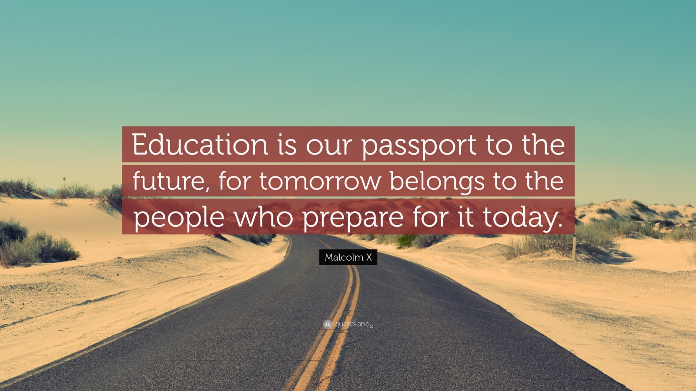

Étant enfant, un peu comme tout le monde, je rêvais d’un monde meilleur, d’un monde où je serais Tony Stark. Je me suis épris de l’informatique, la technologie en général. J’ai commencé la programmation en auto-didacte et aujourd’hui, j’en ai fait une passion. Ces dernières années, j’ai rencontré des personnes qui comme moi, mourraient d’envie d’apprendre à programmer, approfondir leurs connaissances du domaine mais qui, pour une raison ou pour une autre n’y parvenaient pas. Bien-sûr, il y a l’école, les formations ou le défi d’être autodidacte mais combien suivent des formations sans pour autant en tirer quelque chose de concret ? Combien trouvent l’école trop ennuyante ou encore trop abstraite ? Combien se lancent tous seuls juste pour se rendre compte de l’immensité de la tâche qu’est d’apprendre tout, tout seul ? C’est de là qu’est née l’idée du Summer Tech-Camp**\***.

Nous avons l’intime conviction que chaque personne a la capacité d’apprendre en auto-didacte si elle mise dans les conditions convenables. Nous pensons que le concept de formateur et de formaté (hum je veux dire, “formé”) est dépassé. En effet, nous traversons une période où le Bénin fait ses premiers pas prometteurs sur le chemin qui fera de lui, une “tech-nation”. L’une des meilleurs périodes pour se lancer dans le numérique, non pas pour chercher du travail mais pour en créer. Si nous aspirons à être une tech-nation dans les années à venir nous devons former des créateurs, des innovateurs, des entrepreneurs. Ainsi, nous organisons le Summer Tech-Camp**\*** pour réunir des jeunes, de futurs acteurs de cette tech-nation pour leur montrer qu’ils peuvent apprendre, créer et innover avec les ressources qu’ils possèdent tous, à travers la collaboration.

Pour y arriver, nous avons pensé à un système susceptible de susciter cette capacité d’apprendre et à innover. Les participants auront à apprendre un langage de programmation à travers la résolution d’exercices et la conception de projets dont la complexité augmentera en fonction de l’évolution du participant. Ces derniers leurs permettront de gagner des points pour débloquer des niveaux supérieurs. Pour encourager la collaboration, les participants gagneront des points à aider leurs camarades. Ce système, dit d’apprentissage horizontal, est loin du modèle du cours magistral qui ne prend pas en compte la diversité des étudiants et qui ne suscite pas la pensée divergente. Dans ce système, les étudiants apprennent d’eux-même, collaborent pour évoluer, apprennent à leur rythme, et sortent gagnants à coups sûr.

Notre objectif est de vous aider à “apprendre à apprendre”, afin qu’après la formation vous puissiez apprendre tout ce que vous voulez apprendre. Nous vous initierons à la résolution de problème, à la pensée critique et au travail d’équipe. D’ailleurs, nous ferons tout ce qui est en notre possible pour vous donner les outils nécessaires pour vous rendre indépendant.

Outre cette immersion en programmation, nous ménerons des discussions sur de divers thèmes, des ateliers et d’autres moments de partage. Que vous soyez amateur, débutant ou encore curieux du code, profitez de l’occasion pour vous enrichir et pour rencontrer des passionnés comme vous dans une bonne ambiance. Le Bénin a besoin de créateurs, et non de formatés. Je conclus avec les mots de Malcom X:

> “Education is our passport to the future, for tomorrow belongs to the people who prepare for it today.”

> “L’éducation est notre passeport vers l’avenir, car demain appartient aux personnes qui se préparent aujourd’hui.”

---

\[\*\]: _Le Summer Tech Camp, après une première édition pleine d’expérience ne sera pas réitéré. J’ai garder le nom dans l’article pour des raisons nostalgiques et contextuelles._
