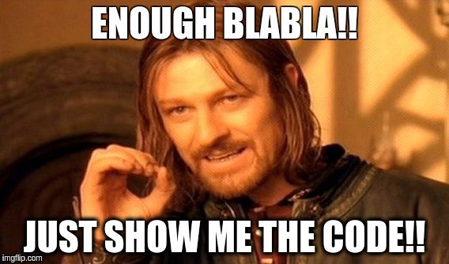

 on [Unsplash](https://unsplash.com?utm_source=medium&utm_medium=referral)](./asset-1.)

_Ceci est le premier article d’une série d’articles nommé “_**_Affiner son Javascript”._**

Le langage JavaScript est, depuis quelques années, le “cool kid” de la cour de récré quand il s’agit de langages de programmation. Ce langage autrefois haït fait maintenant l’objet de plusieurs convoitises. On peut quasiment tout faire avec ce langage (application web, [mobile](https://facebook.github.io/react-native/) ou [desktop](https://electronjs.org) ; [serveurs](https://expressjs.com) ou [encore de l’IoT](https://cylonjs.com)).

Cette évolution de la notoriété du langage s’est aussi accompagnée d’une métamorphose de la syntaxe de celle-ci. Aujourd’hui on parle de syntaxe ES6, ES2015, ES7, ES2016 ou encore ES8 et ma foi qu’on s’y perd un peu. Mettons-y un peu de lumière.

Embed placeholder 0.666629152500533

### Petite histoire…

Au départ, le langage (développé par Netscape) était sortie sous le nom de **LiveScript** en Septembre 1995 puis il a été renommé en **JavaScript** afin de tirer profit du succès du langage de programmation **Java**. En 1996, le langage a été soumis à ECMA International pour en faire un standard. La nouvelle specification standardisée est alors nommée **ECMAScript**.

Par conséquent, **ECMAScript** c’est le standard et **JavaScript** c’est l’implémentation la plus connue et la répandue de ce standard.

Après la standardisation, ECMAScript a connu plusieurs éditions: ECMAScript 1, 2 et 3 sorties respectivement en Juin 1997, Juin 1998 et en Décembre 1999. Puis il y a eu la version 4 du standard qui a été abandonnée. La version 5 du standard qui est sortie en Décembre 2009. Enfin les versions récentes 6, 7 et 8 sorties respectivement en Juin 2015, 2016 et 2017.

Ainsi, quand vous voyez “**ES\*”** comme dans ES6, ES7 et ES8, pensez “ECMAScript version 6, 7 ou 8”. Et d’ailleurs **ES6 == ES2015**; **ES7 == ES2016** et **ES8 == ES2017.**

**_NB_**_: Pour les besoins de cette série on se penchera sur la sixième édition du standard étant la plus utilisée et la plus répandue._

### Show me the code !

En termes de code, ES6 vient avec plusieurs fonctionnalités qui rendent l’utilisation de JavaScript plus ‘agréable’ et plus pratique comme l’illustre le comparatif entre ES5 et ES6 dans le snippet ci-dessous:

J’expliquerai chacune de ces fonctionnalités et plus encore dans les articles suivants de cette série.

### Pourquoi apprendre ES6 ?

À mon avis, il y a mille et une raisons pour apprendre la syntaxe ES6, en voici quelques-unes:

-   La syntaxe apporte de nouvelles fonctionnalités qui rendent le langage plus élégant, plus maniable et plus agréable à utiliser (comparé à ES5).
-   Certaines fonctionnalités comme les modules et les classes permettent de mieux organiser son code à grande échelle.
-   La plupart des frameworks front-end comme React, Vue ou Angular recommandent l’usage de la syntaxe ES6 lors du dévéloppement avec des outils comme Webpack et Babel.
-   C’est une édition du standard qui sert de fondation pour les éditions suivantes. Donc si vous comprenez la syntaxe ES6, vous aurez compris une grande partie des syntaxes ES7 et ES8.
-   ES5 finira par être abandonnée avec le temps et étant donné qu’ES6 est **_backwards-compatible_** (i.e tout ce qui fonctionne en ES5 fonctionne aussi en ES6) c’est tout bénef !

---

En conclusion, **ES6** fait partie du futur de JavaScript et sa maitrise s’avérera de plus en plus en dispensable si elle ne l’est déjà. Cette série d’articles, c’est pour ceux qui désirent se mettre à jour ou qui désirent mieux comprendre les nouvelles fonctionnalités d’ES6.

Embed placeholder 0.07899131298347917
