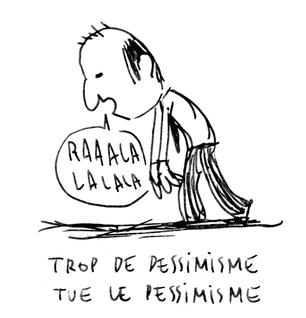

Mener à bien un projet n’est pas chose aisée, surtout quand on est pessimiste comme moi.

Le pessimisme, souvent confondu au réalisme par ceux qui sont pessimistes, est l’une des choses qui peut freiner voire empêcher l’aboutissement d’un projet. Il se présente sous plusieurs formes à travers certains réflexes et/ou habitudes:

### Et si…

Faire des suppositions et formuler des hypothèses n’ont rien de mal, les choses se gâtent lorsqu’on transforme celle-ci en affirmations vraies et valides sans vérification. Une fois vraies à nos yeux, on base tout nos raisonnements sur elles, espérant aboutir à des conclusions vraies et objectives. Inutile de préciser à quel point ces conclusions sont décevantes et loin de la réalité, étant donné qu’elles sont basés sur des prémisses fausses.

### Je parie que ça ne marcheras pas…

L’un des exercices préférés du pessimiste c’est de trouver la circonstance dans laquelle une idée donnée est fausse ou encore irréalisable. “Ca marcheras pas”, “C’est impossible”, “Ils n’achèteront jamais” s’exclame t-on sans prendre le temps de considérer et d’analyser. La réponse est quasi instinctive, comme un besoin de montrer que l’autre à tord. D’emblée, on érige un mur, une forteresse sur des raisons qui sont tout sauf objectives. Steve Ballmer, ex-PDG de Microsoft, pensait que l’iPhone serait une catastrophe et il en riait à cœur joie, pourtant, aujourd’hui le succès de l’iPhone n’est plus sujet à débat.

### Par expérience…

L’expérience peut s’avérer dangereuse dans certaines situations. L’esprit de l’expérimenté, s’étant rigidifier avec les années, conçoit difficilement que ces acquis peuvent être erronés. Parfois appliquer l’expérience acquise par le passé peut nous induire en erreur. L’histoire ne se répète pas toujours et parfois les leçons qu’on tire d’une situation ne s’applique pas à d’autres. De plus, le fait “de savoir qu’on sait” limite notre champ d’action, on est moins enclin à faire des choses hors du spectre de notre expérience. Shunryu Suzuki, grand maître Zen, le dit mieux que moi:

> “Dans l’esprit du débutant, il existe de nombreuses possibilités, mais dans celui de l’expert, il y en a peu.”

---

Je pense qu’on a tous une pincée de pessimisme en nous, il faut juste reconnaître quand celle-ci se manifeste afin de corriger le tir. En utilisant les bons mots, en testant nos hypothèses et en évitant de prédire l’avenir, on s’épargne quelques misères et quelques erreurs.

---

#### C’était intéressant ?

_N’hésitez pas à le partager ou à laisser des commentaires. Et surtout applaudissez 👏 👏 👏, ça pourrait aider d’autres personnes à retrouver l’article._
