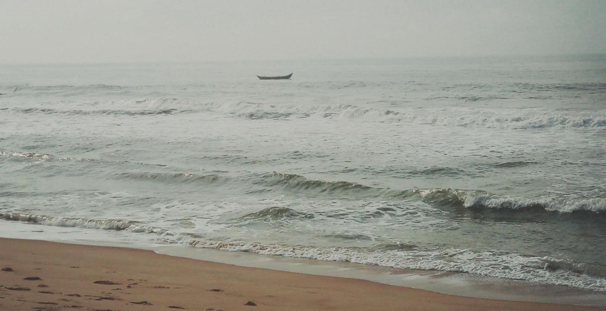

## Addiction et Constance

> Ces mots ont été écris en écoutant [Corbeau Blanc de Julien Doré](https://www.youtube.com/watch?v=TmQvBEyX1Wk). Je recommande de lire ces mots en l’écoutant.

Salut, je m’appelle Nelson et j’ai une addiction.

Une addiction que j’ai du mal à reconnaitre, après tout je suis accro… D’ailleurs, plus j’y pense plus je me rends compte qu’elle s’immisce dans ma vie et détruit tout ce qui m’entoure. Parfois j’ai l’impression d’être comme un rat qui court sans cesse dans une roue croyant qu’il finira par avoir son fromage.

Voyez vous, tout au long de l’année 2018, je me suis laisser aller à elle. Elle me rendait heureux sur le coup, elle me donnait l’espoir qu’ailleurs ou qu’après serait mieux qu’ici ou maintenant. Et donc, encore et encore je prenais ma dose: j’abandonnais des projets pour d’autre que j’abandonnais aussi, face aux difficultés je fuyais et quand il fallait s’engager je trouvais un moyen de m’échapper. C’était le pouvoir qu’elle me donnait: fuire, abandonner, m’échapper.

Néanmoins, elle était gourmande. Elle ne donnait pas sans prendre le double. Pour l’espoir, elle arrachait l’assurance et la conviction (et bonjour le doute intense et existentiel). Quand bien même elle me permettait d’abandonner, de fuire ou de m’échapper, face au tourment du doute, de la dépression et de l’aliénation, elle était aux abonnés absents. J’étais donc livré à moi même, face à mes démons, les créations de mon incapacité à m’engager, à faire face à l’adversité, à briser les murs créés par mon imagination ou encore, tout simplement, à finir ce que je commence.

---

Salut, je m’appelle Nelson et j’avais une addiction.

Une addiction que j’ai combattu et que je continue à combattre. Aujourd’hui, cela fait déjà un peu plus de 30 jours que je suis en désintoxication. C’est difficile mais, une bonne habitude à la fois, je me débarrasse d’elle. J’avoue que je n’y suis pas encore et que c’est un processus qui prend du temps. Pourtant cette désintoxication, bien que lente et douloureuse, est indispensable.

J’ai créé des murs dans ma tête, des illusions qui m’ont longtemps retenues. Aujourd’hui, une à une je les brise, un coup à la fois encore et encore. Qu’importe le temps que ça prendra ces murs ne seront que des reliques d’un passé lointain. Je guérirai et je ne serai plus son hôte. Je lutterai chaque jour pour la déraciner, aussi enracinée soit-elle.

_Ceci est un adieu à la personne que j’étais, un manifeste pour la personne que je suis et un rappel à la personne que je serai._
