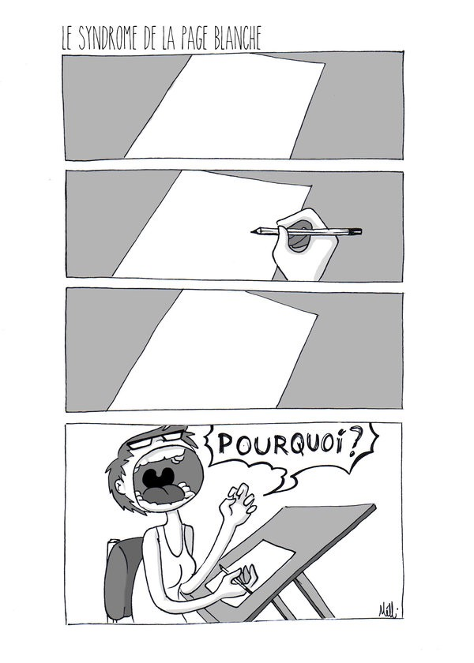

## Un remède contre le syndrome de la page blanche

L’écriture est l’une de mes passions. Pour moi, écrire c’est exprimer ce que l’on pense, matérialiser ce que l’on voit, vit ou imagine.

Néanmoins, écrire c’est aussi une tâche ardue et sinueuse. Nous connaissons tous le, tristement célèbre, syndrome de “la page blanche”. On l’a tous vécu à un moment ou un autre. Très souvent, les idées à articuler dans le contenu à rédiger sont claires dans notre esprit, pourtant il est difficile de pondre la moindre phrase. Le problème c’est qu’on a souvent tendance à corriger avant d’écrire. Au lieu d’écrire directement les idées et les bribes d’idées au fur et à mesure qu’elles viennent, on essaie de les corriger, de les mettre en forme avant de se dissuader de les écrire et le résultat final c’est une page vierge.

> “Write drunk, edit sober” (Écrivez ivre, corrigez sobre)

La solution que nous propose cette merveilleuse citation probablement de Ernest Hemingway, c’est d’écrire d’abord sans limite et concession et de corriger ensuite. Cela nous évite de porter les chapeaux d’écrivain et d’éditeur à la fois. Le tout c’est d’écrire librement, avec des fautes, des phrases voire des paragraphes incomplets qu’importe ! L’essentiel c’est d’écrire pour avoir matière à corriger et embellir si besoin.

Un outil formidable que j’utilise pour cette tâche c’est [Draft](https://draftin.com) qui propose deux outils: Le “Hemingway mode” et le contrôle de versions. Le “Hemingway mode” désactive la fonctionnalité d’effacer ou de corriger le contenu actuel, vous empêchant ainsi de jouer le rôle de l’éditeur pendant que vous écrivez. L’outil de contrôle de versions vous permet d’avoir plusieurs versions du même texte, des brouillons en quelques sortes que vous pouvez corriger et commenter au besoin. Cette fonctionnalité me permet d’effacer du contenu sans me soucier de l’avoir perdu.

### Conclusion

Le secret c’est de ne pas s’inquiéter, écrivez juste et le reste viendra. Ce principe ne s’applique pas seulement à l’écriture mais aussi à beaucoup d’autres domaines comme le design. Evitez de vous soucier, commencez et les nœuds se dénoueront avec le temps.

---

### C’était intéressant ?

_N’hésitez pas à le partager ou à laisser des commentaires. Et surtout applaudissez 👏 👏 👏, ça pourrait aider d’autres personnes à retrouver l’article._
