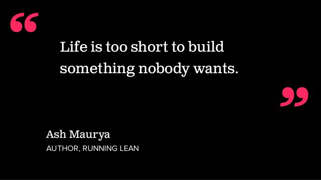

## Concevoir des produits que des gens veulent et d’autres leçons…

Le dénominateur commun de la réussite et de l’échec, pour l’entrepreneur, c’est les leçons qu’il en tire. Au fil du temps, avec la recherche, la curiosité et l’expérience chacun d’entre nous a accumulé et continue d’accumuler des connaissances, des astuces, des “à-ne-surtout-pas-faire” qui font désormais partie de ce qui définit notre parcours entrepreneurial.

> Trop de startups échouent faute de connaissances des principes clés de l’entreprenariat.

### Il était une fois

Tony, jeune homme diplômé d’une licence en Informatique, rêve depuis tout petit de créer son propre empire technologique à l’instar de Jobs ou Zuckerberg. Afin de concrétiser ce rêve, il travaille d’arrache-pied pendant deux ans sur une idée révolutionnaire avec des amis. “Les géants de la Silicon Valley ont commencé pour la plupart dans un garage”, se rassurait-il. Puis vint le jour où son produit, fin prêt, devait voir le jour. Champagne et réjouissances, le lancement fut une belle fête. Les jours passèrent et devinrent des semaines, les semaines devinrent des mois pourtant demeurait un constat accablant : Personne ne semblait s’intéresser à son produit “révolutionnaire”. Il avait beau le partager sur les réseaux sociaux et en parler à qui voulait bien l’écouter mais rien n’y fit. Six mois plus tard, ses amis et lui déçus et abattus furent obligés de fermer boutique. Pour se réconforter, ils se mirent tous d’accord sur la raison de leur échec : “Le marché n’est pas prêt ! Sinon, il aurait reconnu la valeur de notre produit.”

](./asset-1.jpeg)

### La réalité

Si comme Tony, vous avez vécu la même situation, j’ai une nouvelle à vous annoncer: L’une des principales raisons pour laquelle les startups échouent c’est parce qu’elles créent des produits pour lesquels n’y a pratiquement aucune demande. Autrement dit, ces dernières créent des produits ou offrent des services dont personne ou très peu de personnes ont besoin. Comme Tony, j’ai toujours pensé que pour vendre un produit, il fallait:

1.  Avoir une idée
2.  En parler à deux ou trois personnes (pas plus de peur qu’on me vole mon idée)
3.  Concevoir le produit pendant des mois sans avis externes
4.  Lancer le produit (Si jusque-là, je n’ai pas encore abandonné pour une raison ou pour une autre)
5.  Faire quelques publications le jour du lancement.
6.  Attendre…
7.  À ce stade, si je ne vois aucun engouement (ce qui arrive très souvent) alors je passe à un autre projet
8.  Reprendre le cycle

Cette conception des choses est erronée, car, non seulement il faut parler de son produit mais il faut aussi commencer par les clients avant d’avancer à la conception du produit. Ainsi, l’objectif premier est d’acquérir une clientèle en visant une cible bien précise, en déterminant le besoin de cette cible puis en concevant un produit qui répond au besoin de cette cible tout en créant de l’anticipation autour de votre solution. Vos clients potentiels devraient attendre la sortie de votre produit avec impatience et non le contraire.

---

### La suite ?

Ces leçons, je les dois à (entre autres) Marcus Ibuka, Seth Godin et Jason Fried. Des auteurs incroyables que j’ai découvert non pas grâce à leurs livres mais grâce à leurs entretiens. Entretiens, qui m’ont poussé à en apprendre plus sur ce qu’ils avaient à enseigner.

On se plaint ici de ne pas être informé, de ne pas avoir [les ressources nécessaires](http://wasexo.surge.sh) à la réussite de la chose entrepreneuriale. C’est de là que m’est venu l’[idée de m’entretenir avec des entrepreneurs](http://wasexo.surge.sh) d’ici et de la sous-région afin qu’ils puissent partager leurs connaissances, expériences et astuces avec d’autres entrepreneurs. J’ai l’intime conviction que de telles ressources profiteraient à tous. Si comme moi, vous partagez cet avis, n’hésitez pas à me contacter par mail ([kamganelson@gmail.com](mailto:kamganelson@gmail.com)) pour quelques échanges ou inscrivez-vous juste [ici](http://wasexo.surge.sh) et surtout partagez ce post aux entrepreneurs de votre entourage.

---

_N’hésitez pas à partager ce post ou à laisser des commentaires. Et surtout applaudissez 👏 👏 👏, ça pourrait aider d’autres personnes à retrouver l’article._
