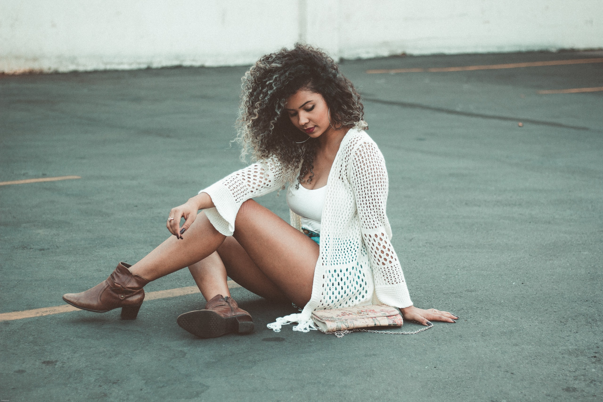
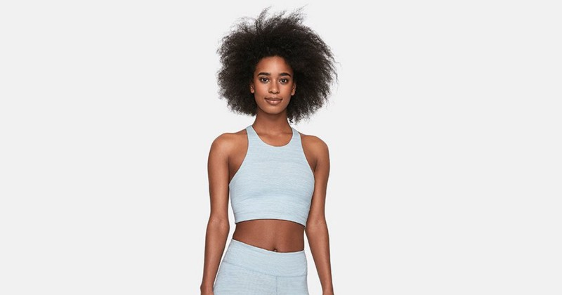
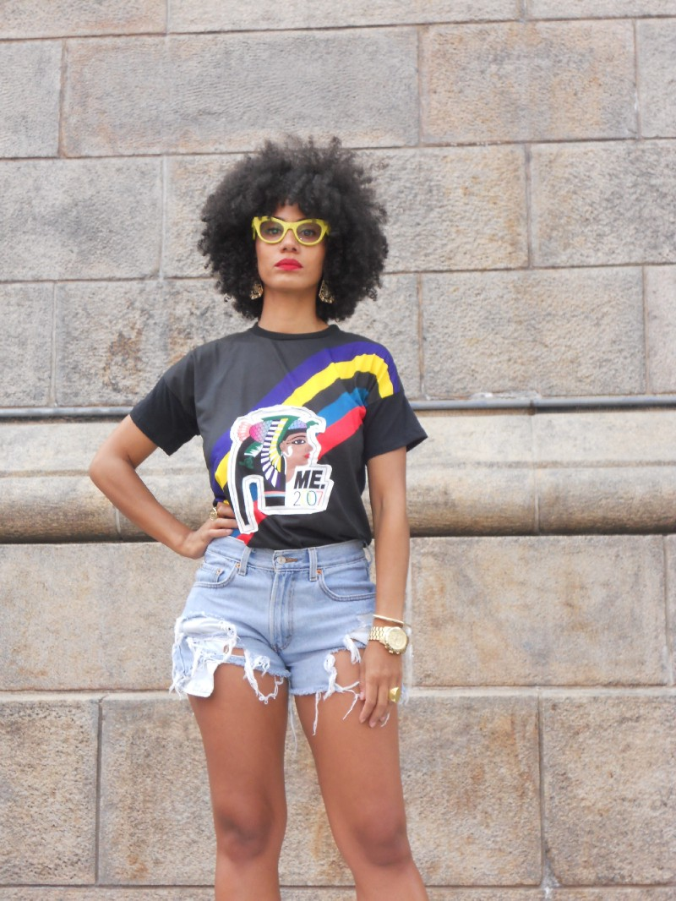
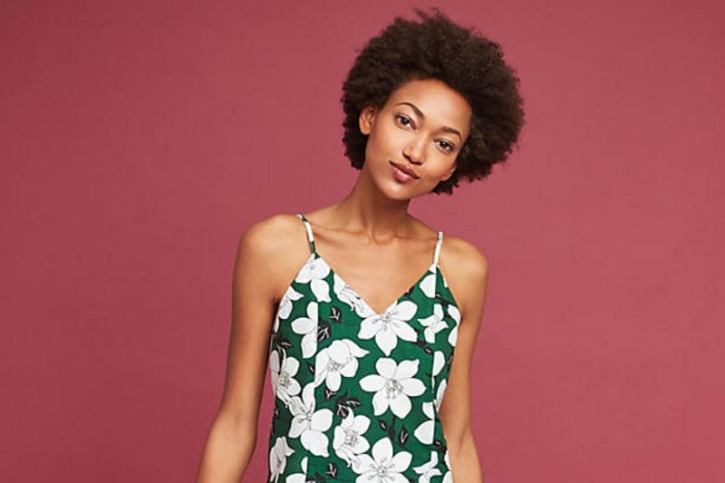

Quand il fait (très) chaud, tes choix de mode se restreignent quelque peu et se dirigent vers des vêtements confortables. Optes donc porter des robes légères, des shorts stylés et des tops courts, mais chic, pour un look adapté à la chaleur. On obtient donc un style estival qui se porte aisément en ville !

### **Crop Top**

Idéal sur un short taille haute ou une jupe noire patineuse, le [**crop top**](https://cumitan.com/products/femmes/product/crop-top-orange-poche/59e56abce3a0d837b85be9ee), ne dévoile ton ventre que si tu le souhaites et apporte une touche lookée à ta tenue.

### Mini Jean

Tout pour être sexy, le [**mini jean**](https://cumitan.com/products/femmes/product/jean-mini-delav/59e56abce3a0d837b85be9f6) t’envoie dans un univers de jeunes filles. Idéal sur un **crop-top**, un [**tee-shirt**](https://cumitan.com/products/femmes/product/haut-blanc-motifs/59e56abce3a0d837b85be9fc) et bien d’autre style de ton choix.

### Robe

**Fleurs et teintes vives** deviennent alors tes meilleures alliées. Surtout des [robes](https://cumitan.com/products/femmes/robes) en dès matière ne pouvant t’exposer à la transpiration comme [les robes **à petites brides**](https://cumitan.com/products/femmes/product/robes-sans-manches/59fb74a76ad6a7482142e3ed).

---

[**_Cumitan_**](https://www.cumitan.com)_, c’est une boutique de vêtement en ligne qui te permet d’exprimer ton unicité à travers ce que tu portes. Pour découvrir le reste de nos produits rends toi sur_ [_www.cumitan.com_](http://www.cumitan.com/)_. Cherches pas loin, tu seras entre de bonnes mains_ 😉.

_À bientôt._
